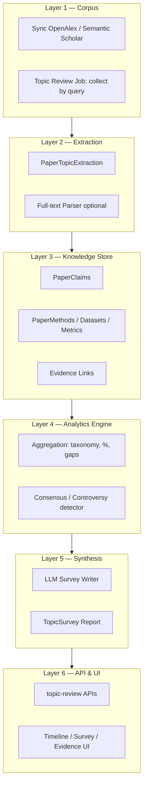

# Master Plan: Automated Literature Review System (Full Vision)


Plan tổng hợp để ScholarTrend đi từ **V2 (Topic Insight Lite)** → **Full AI Research Review / Survey Paper Generator** — đủ 10 output mô tả trong yêu cầu sản phẩm.


---


## 1. North Star — Sản phẩm cuối cùng là gì?


**Input:**


```json
POST /api/topic-review/jobs
{
  "topic": "Medical AI for Cancer Detection",
  "maxPapers": 500,
  "yearFrom": 2010,
  "language": "en"
}
```


**Output (sau vài phút–vài giờ):**


```json
GET /api/topic-review/jobs/{jobId}/report
```


Trả về **Survey Report** gồm đủ 10 phần:


1. Overview narrative (survey-style)
2. Evolution timeline (semantic milestones)
3. Research taxonomy + %
4. Methods catalog (ưu/nhược + paper count)
5. Datasets catalog
6. Consensus findings
7. Controversies
8. Research gaps (suy luận từ corpus)
9. Future opportunities (evidence-based)
10. Confidence + evidence cho mọi claim


**Nguyên tắc vàng:** Mọi nhận định phải trace được về `paperId` + excerpt + confidence.


---


## 2. Tại sao không làm “1 prompt LLM đọc 500 paper”?


| Cách | Vấn đề |
|---|---|
| 500 abstract → 1 LLM prompt | Vượt context, tốn tiền, hallucinate %, không trace evidence |
| Gọi LLM mỗi lần user mở trang | Chậm, không scale, chi phí không kiểm soát |


**Cách đúng:** Pipeline nhiều tầng + knowledge base có cấu trúc + background jobs + cache.


```
Paper Collection
    ↓
Structured Extraction (per paper)
    ↓
Aggregation & Statistics (deterministic)
    ↓
Evidence Graph
    ↓
LLM Synthesis (chỉ viết narrative từ facts đã có)
    ↓
Survey Report
```


**Vì sao:** Tách **facts** (số liệu, count, paper links) khỏi **narrative** (LLM viết văn) → giảm hallucination, tăng explainability.


---


## 3. Kiến trúc tổng thể (6 layer)





---


## 4. Database schema đầy đủ (bổ sung trên V2)


### 4.1 Đã có / giữ từ V2


- `TopicInsight` (per year)
- `TopicInsightEvidence`
- `PaperTopicExtraction`
- `TopicInsightJob`
- `TopicTrends` (chart — **không** để AI tính lại)


### 4.2 Bổ sung cho Full Vision


#### `TopicReviewJob` — job cấp topic (free-text)


```csharp
public class TopicReviewJob
{
    public int Id { get; set; }
    public string? TopicId { get; set; }           // nullable — map topic DB nếu có
    public string QueryText { get; set; }          // "Medical AI for Cancer Detection"
    public string Status { get; set; }             // Queued|Collecting|Extracting|Analyzing|Synthesizing|Completed|Failed
    public int TargetPaperCount { get; set; }
    public int CollectedPaperCount { get; set; }
    public int ExtractedPaperCount { get; set; }
    public string? ErrorMessage { get; set; }
    public DateTime CreatedAt { get; set; }
    public DateTime? CompletedAt { get; set; }
}
```


**Tại sao:** Vision dùng `POST /api/topic-review` với topic free-text, không chỉ `topicId` cố định.


---


#### `PaperTopicExtraction` (mở rộng schema)


```csharp
public class PaperTopicExtraction
{
    public int Id { get; set; }
    public int PaperId { get; set; }
    public int TopicId { get; set; }               // hoặc TopicReviewJobId


    // Structured extraction (JSON)
    public string ResearchDirectionsJson { get; set; }  // ["Image Analysis", "NLP"]
    public string MethodsJson { get; set; }            // ["CNN", "ViT"]
    public string DatasetsJson { get; set; }           // ["ISIC", "BraTS"]
    public string MetricsJson { get; set; }            // ["accuracy", "AUC"]
    public string TasksJson { get; set; }              // ["classification", "segmentation"]
    public string LimitationsJson { get; set; }
    public string FutureWorkJson { get; set; }
    public string MainClaim { get; set; }
    public string? AchievementHint { get; set; }


    public string ModelName { get; set; }
    public double ExtractionConfidence { get; set; }
    public DateTime ExtractedAt { get; set; }
}
```


**Tại sao:** Mọi output (#3–#9) đều cần structured fields, không chỉ text summary.


---


#### `PaperClaim` — phục vụ consensus & controversy


```csharp
public class PaperClaim
{
    public int Id { get; set; }
    public int PaperId { get; set; }
    public int TopicReviewJobId { get; set; }
    public string ClaimType { get; set; }    // Result | Comparison | Method
    public string Subject { get; set; }      // "Transformer vs CNN"
    public string Predicate { get; set; }    // "outperforms" | "no difference"
    public string? Object { get; set; }
    public string? ConditionsJson { get; set; } // dataset, task, metric
    public string SourceSection { get; set; }  // Abstract | Discussion
    public string Excerpt { get; set; }
    public double Confidence { get; set; }
}
```


**Tại sao:** Consensus (#6) và Controversy (#7) cần so sánh claims across papers, không thể chỉ đếm keyword.


---


#### `TopicSurvey` — báo cáo cấp topic (không theo năm)


```csharp
public class TopicSurvey
{
    public int Id { get; set; }
    public int TopicReviewJobId { get; set; }


    public string OverviewNarrative { get; set; }      // #1 Survey overview
    public string TimelineJson { get; set; }           // #2 Semantic milestones
    public string TaxonomyJson { get; set; }           // #3 Directions + %
    public string MethodsCatalogJson { get; set; }     // #4
    public string DatasetsCatalogJson { get; set; }    // #5
    public string ConsensusJson { get; set; }          // #6
    public string ControversiesJson { get; set; }      // #7
    public string ResearchGapsJson { get; set; }       // #8
    public string FutureOpportunitiesJson { get; set; }// #9


    public int PaperCount { get; set; }
    public string ModelName { get; set; }
    public DateTime GeneratedAt { get; set; }
    public bool IsActive { get; set; }
}
```


**Tại sao:** `TopicInsight` theo năm phục vụ timeline UI; `TopicSurvey` là document tổng hợp toàn topic.


---


#### `SurveyEvidence` — evidence cho mọi claim trong report


```csharp
public class SurveyEvidence
{
    public int Id { get; set; }
    public int TopicSurveyId { get; set; }
    public string SectionKey { get; set; }   // "gap.multimodal" | "consensus.vit_vs_cnn"
    public int PaperId { get; set; }
    public string EvidenceType { get; set; }
    public string Excerpt { get; set; }
    public double Confidence { get; set; }
}
```


**Tại sao:** Đáp ứng #10 — mọi câu trong report đều có bằng chứng.


---


## 5. Pipeline chi tiết — 7 phase triển khai


### PHASE 0 — Foundation (2 tuần)


**Mục tiêu:** Nền tảng kỹ thuật, tận dụng ScholarTrend hiện có.


| Việc | Cách làm | Tại sao |
|---|---|---|
| Scale sync | Mở rộng OpenAlex/Semantic Scholar query theo topic text | Cần 300–500 papers, không đủ 20 paper seed |
| Topic mapping | `topic query` → search API → import → `PaperTopics` | Free-text topic cần corpus builder |
| Job framework | Hangfire + `TopicReviewJob` status machine | Async, không block HTTP |
| Config | `AiSettings`, `ReviewSettings` (min papers, max papers, model) | Kiểm soát chi phí & chất lượng |


**Deliverable:** `POST /topic-review/jobs` tạo job, collect papers, status API.


---


### PHASE 1 — V2 Topic Insight (2–3 tuần)


*(Plan V2 đã thống nhất)*


| Output | Cách |
|---|---|
| Timeline theo năm | `TopicInsight.Achievement` |
| Trend dashboard | `TopicTrends` + pins |
| Opportunities cơ bản | `ResearchGapsJson`, `FutureDirectionsJson` + evidence |


**Tại sao làm trước:** Demo sớm, FE làm UI, không chờ full pipeline.


---


### PHASE 2 — Structured Extraction (3–4 tuần)


**Mục tiêu:** Mỗi paper → JSON có cấu trúc.


**Cách làm:**


1. Prompt LLM với schema cố định (JSON mode / function calling)
2. Input: title + abstract (+ full-text nếu có)
3. Output → `PaperTopicExtraction` + `PaperClaim`
4. Chạy background, idempotent (skip paper đã extract)
5. Validate JSON schema trước khi lưu


**Prompt design (ví dụ):**


```
Extract from this paper:
- research_directions[]
- methods[]
- datasets[]
- metrics[]
- limitations[]
- future_work[]
- main_claim
- comparative_claims[] (A outperforms B on dataset X)
Return JSON only.
```


**Tại sao per-paper, không per-topic:**


- Cache được — paper mới chỉ extract 1 lần
- Scale — batch 500 paper song song
- Regenerate survey không tốn lại token extract


**Deliverable:** 80% papers trong job có extraction record.


---


### PHASE 3 — Analytics Engine (2–3 tuần)


**Mục tiêu:** Sinh facts bằng code, không LLM.


| Output vision | Cách làm (deterministic) |
|---|---|
| **#3 Taxonomy + %** | Count `research_directions` across papers → pie chart data |
| **#4 Methods catalog** | Frequency `methods[]` + top papers per method |
| **#5 Datasets** | Frequency `datasets[]` + usage count |
| **#8 Distribution gaps** | Rule: nếu direction A > 80% và A+B < 5% → gap "B underexplored in combination with A" |
| **#8 Metric gaps** | 99% có `accuracy`, <3% có `fairness` → gap |


**Ví dụ rule gap:**


```
if pct(modality=CT) > 0.90 and pct(modality=CT+EHR) < 0.05:
    gap = "Multimodal CT+EHR underexplored"
    evidence = papers_missing_combination
    confidence = 1 - pct(CT+EHR)
```


**Tại sao rule + stats trước LLM:**


- % phải chính xác — LLM hay bịa "85%"
- Gap phân bố là pattern across corpus — statistics đáng tin hơn NLP


**Deliverable:** `TopicAnalyticsResult` JSON (taxonomy, methods, datasets, rule-based gaps).


---


### PHASE 4 — Consensus & Controversy (2–3 tuần)


**Mục tiêu:** Output #6 và #7.


**Cách làm:**


1. Nhóm `PaperClaim` theo `(subject, conditions)` — ví dụ "ViT vs CNN on ImageNet-like medical imaging"
2. **Consensus:** ≥70% claims cùng hướng (outperforms / not better)
3. **Controversy:** có cả outperforms A và outperforms B, hoặc "no difference"


```
Claims grouped by:
  subject: "Transformer vs CNN"
  conditions: { task: classification, domain: medical imaging }


  Paper 1: Transformer outperforms CNN
  Paper 2: Transformer outperforms CNN
  Paper 3: No significant difference
  → Controversy: 67% vs 33%, no consensus
```


**Tại sao cần `PaperClaim` riêng:** Không thể infer controversy chỉ từ methods frequency.


**Deliverable:** `ConsensusJson`, `ControversiesJson` trong analytics layer.


---


### PHASE 5 — Timeline semantic (1–2 tuần)


**Mục tiêu:** Output #2 — không chỉ "năm 2021 có 15 papers" mà "2021: Vision Transformer emerged".


**Cách làm:**


1. Group papers by year
2. Lấy top methods mới xuất hiện mỗi năm (first-seen year per method)
3. LLM viết milestone 1 câu từ: `{ year, newMethods, topPaperTitles, paperCount }`
4. Merge vào `TimelineJson`


**Tại sao hybrid:** First-seen method = fact; milestone narrative = LLM.


---


### PHASE 6 — Survey Synthesis (2 tuần)


**Mục tiêu:** Output #1, #9 — narrative survey + future opportunities.


**Cách làm:**


LLM nhận **chỉ structured facts**, không nhận 500 raw abstract:


```json
{
  "topic": "Medical AI for Cancer Detection",
  "paperCount": 487,
  "yearRange": "2012-2025",
  "taxonomy": [...],
  "topMethods": [...],
  "topDatasets": [...],
  "consensus": [...],
  "controversies": [...],
  "ruleBasedGaps": [...],
  "timelineMilestones": [...]
}
```


**Prompt constraint:**


- Mọi câu phải reference `factId`
- Không được invent percentages
- Output sections map vào `TopicSurvey`


**Tại sao:** LLM chỉ "viết survey" từ facts đã verify — giống journalist viết từ research notes.


**Deliverable:** `TopicSurvey` record + `SurveyEvidence` links.


---


### PHASE 7 — API, UI, Ops (2 tuần)


| API | Mô tả |
|---|---|
| `POST /api/topic-review/jobs` | Tạo job (free-text topic) |
| `GET /api/topic-review/jobs/{id}/status` | Progress % |
| `GET /api/topic-review/jobs/{id}/report` | Full survey report |
| `GET /api/topic-review/jobs/{id}/report/sections/{key}` | Lazy load section |
| `GET /api/topic-review/jobs/{id}/evidence/{sectionKey}` | Evidence drill-down |
| `GET /api/topics/{id}/insights/*` | V2 endpoints (dashboard, timeline) |


**UI sections:**


- Survey overview (long read)
- Interactive timeline
- Taxonomy treemap / pie
- Methods & datasets tables
- Consensus vs controversy cards
- Research gaps với evidence count
- "View source papers" link


---


## 6. Map đầy đủ: 10 output vision → component nào sinh ra


| # | Output | Layer sinh | LLM? |
|---|---|---|---|
| 1 | Survey overview | `TopicSurvey.OverviewNarrative` | Có (từ facts) |
| 2 | Semantic timeline | `TopicSurvey.TimelineJson` + `TopicInsight` | Hybrid |
| 3 | Taxonomy + % | Analytics engine | Không |
| 4 | Methods catalog | Analytics + LLM mô tả ưu/nhược | Hybrid |
| 5 | Datasets catalog | Analytics | Không (mô tả optional LLM) |
| 6 | Consensus | Claim grouper | Không |
| 7 | Controversy | Claim grouper | Không |
| 8 | Research gaps | Rule engine + LLM diễn giải | Hybrid |
| 9 | Future opportunities | Gap combinatorics + LLM | Hybrid |
| 10 | Confidence + evidence | `SurveyEvidence` + counts | Không (tính từ data) |


---


## 7. Quyết định kỹ thuật quan trọng & lý do


| Quyết định | Tại sao |
|---|---|
| **Abstract-first, full-text optional** | 80% value từ abstract; full-text (PDF parse) tốn effort — phase sau |
| **JSON schema cứng cho extraction** | Parse được, validate được, aggregate được |
| **Stats layer tách khỏi LLM** | Tránh hallucinate % |
| **Evidence table bắt buộc** | Academic credibility + debug |
| **Async jobs, không sync API** | 500 papers = phút đến giờ |
| **Idempotent extraction** | Paper extract 1 lần, survey regenerate nhiều lần |
| **Min corpus threshold (50–100 papers)** | Dưới ngưỡng → báo insufficient, không fake survey |
| **Model tiering** | Extract: GPT-4o-mini/Gemini Flash; Synthesis: GPT-4o — balance cost/quality |
| **Giữ `TopicTrends` cho chart** | Single source of truth cho số liệu trend |


---


## 8. Full-text (optional Phase 8 — nếu muốn 90% → 95%)


| Cách | Effort | Gain |
|---|---|---|
| Chỉ abstract | Thấp | ~70% survey quality |
| OpenAlex abstract + landing page | Trung bình | +10% |
| PDF download + GROBID/parser | Cao | Method, Dataset, Limitation chính xác hơn |


**Khuyên:** Ship full pipeline với abstract trước; full-text là enhancement.


---


## 9. Timeline tổng hợp (team 3–4 người)


| Phase | Tuần | Output |
|---|---|---|
| 0 — Foundation | 1–2 | Corpus builder + job API |
| 1 — V2 Insight | 2–3 | Timeline + dashboard + basic gaps |
| 2 — Extraction | 3–4 | Structured per-paper JSON |
| 3 — Analytics | 2–3 | Taxonomy, methods, datasets, rule gaps |
| 4 — Claims | 2–3 | Consensus + controversy |
| 5 — Timeline semantic | 1–2 | Milestone narrative |
| 6 — Survey synthesis | 2 | Full `TopicSurvey` report |
| 7 — API + UI | 2 | End-to-end product |
| 8 — Full-text (opt) | 3–4 | Quality boost |


**Tổng:** ~14–20 tuần (3.5–5 tháng) cho full vision với team nhỏ.


---


## 10. Chi phí & scale ước tính


| Hạng mục | 500 papers |
|---|---|
| Extraction (~1K tokens/paper) | ~500K tokens ≈ $0.5–5 (model dependent) |
| Survey synthesis | ~10–20K tokens ≈ cents |
| Storage | SQL Server — nhẹ |
| Hangfire jobs | Đã có |


**Tại sao cache per-paper quan trọng:** Regenerate survey 10 lần không tốn lại 500 extraction calls.


---


## 11. Rủi ro & cách giảm


| Rủi ro | Giảm |
|---|---|
| Hallucination | Facts layer + evidence mandatory |
| Corpus nhỏ | Min threshold + warning UI |
| Extraction sai | Human review sample + confidence threshold |
| Topic quá rộng | Auto-suggest sub-topics hoặc limit scope |
| LLM API down | Queue retry + fallback rule-only report |
| SWP deadline | Ship phased — V2 demo trước, full report sau |


---


## 12. Lộ trình đề xuất thực tế (không làm hết 1 lần)


```
Sprint 1–2:  Phase 0 + Phase 1 (V2)           → Demo được
Sprint 3–4:  Phase 2 (Extraction)             → Data có cấu trúc
Sprint 5–6:  Phase 3 + 4 (Analytics + Claims) → 60% full vision
Sprint 7–8:  Phase 5 + 6 (Survey)             → 85% full vision
Sprint 9+:   Phase 7 UI + Phase 8 full-text   → 90–95%
```


**Positioning báo cáo SWP:**


- Milestone 1: Topic Intelligence (V2)
- Milestone 2: Structured Research Analytics
- Milestone 3: AI Survey Report Generator


---


## 13. So sánh V2 vs Full Vision


| Câu hỏi | Trả lời |
|---|---|
| Full vision có khả thi không? | **Có**, với pipeline đúng (không one-shot LLM) |
| V2 có đủ không? | **Không** — V2 là ~40%, nhưng là nền đúng |
| Làm full cần gì nhất? | `PaperTopicExtraction` mở rộng + `PaperClaim` + Analytics engine + `TopicSurvey` |
| Điểm khác biệt lớn nhất so V2? | Thêm **claim layer** + **topic-level survey** + **free-text topic job** |
| Bắt đầu từ đâu? | Phase 0 → V2 → Extraction — không nhảy thẳng survey |


---


## 14. Tài liệu liên quan


- Plan V2 (Topic Insight): xem discussion team / entity design `TopicInsight`, `TopicInsightEvidence`, `PaperTopicExtraction`, `TopicInsightJob`
- `TopicTrends` — dùng cho chart, không để AI tính lại trend score
- Sync pipeline: `docs/06-admin-sync.md`
- Trend & personalization: `docs/05-trend-personalization.md`


---


*ScholarTrend — SU26SWP06 · Automated Literature Review Master Plan*


